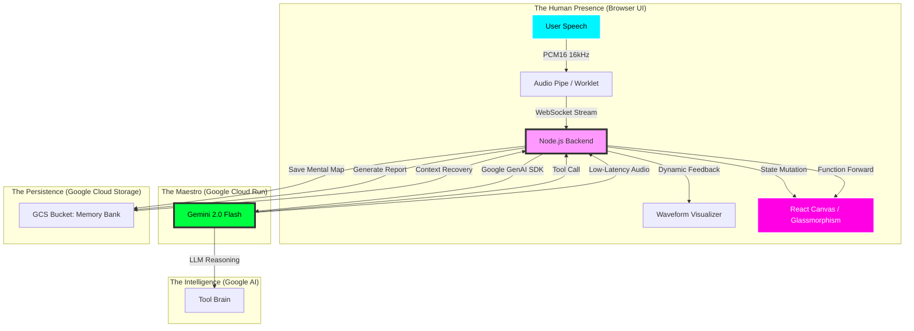
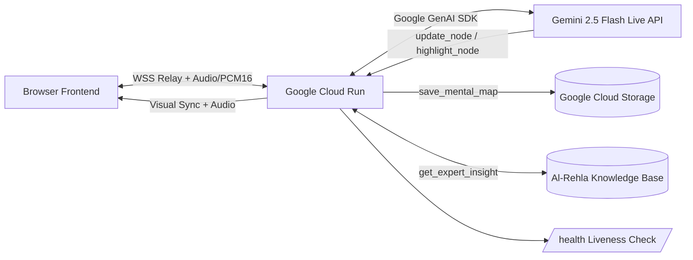

# Dawayir Architecture: The Maestro & The Mental Space

Dawayir is not just an application; it is a **multimodal consciousness bridge** powered by Google Gemini. The architecture follows a high-performance, low-latency relay pattern designed for the Live Agents track of the Gemini Live Agent Challenge.

## The Visual Journey (System Overview)

## Technical Pillars

### 1. High-Fidelity Audio Streaming (The Pulse)
- **Sub-200ms Latency Requirement:** In conversational AI, if a response takes over 200ms, the "magic" is lost. Dawayir abandons traditional Request-Response (REST) patterns completely in favor of WebRTC-like continuous stream processing.
- **Ingress:** The browser captures raw audio through an `AudioWorkletProcessor`, converts it to **PCM16** at **16kHz** (optimized for Gemini), and streams it via high-speed binary WebSockets.
- **Egress:** Gemini returns low-latency audio chunks (24kHz) which are re-assembled and played through the `Web Audio API` using a precision playback queue. This ensures seamless audio delivery even during high-frequency interruptions.

### 2. The Interactive Orchestrator (Node.js Maestro)
The server acts as a **full-duplex bridge** using the `Google GenAI SDK`. It manages the stateful session between the client and Google's servers, ensuring that tool calls are redirected to the frontend in milliseconds.
- **Location:** Deployed on **Google Cloud Run** for sub-second scaling and high availability.
- **Compliance:** 100% Google infrastructure, utilizing SDK-level session management.

### 3. The Memory Bank (GCS Grounding)
Unlike standard chatbots, Dawayir has a **long-term memory**. 
- **Mental Map Snapshots:** Using `save_mental_map`, the agent serializes the visual state of the user's mind and persists it to **Google Cloud Storage** as JSON.
- **Therapeutic Artifacts:** `generate_session_report` creates Markdown-based insights stored in GCS, allowing users to track their mental clarity journey over time.
- **Session Continuity:** A custom context relay mechanism ensures that if a connection is lost, Gemini resumes the conversation with full awareness of the previous 5 segments of dialogue and the exact state of the visual canvas.

### 4. Visual Consciousness (React Canvas State Engine)
- **Dynamic Mental Space:** A bespoke canvas renderer using `requestAnimationFrame` for buttery-smooth animations.
- **Glassmorphism Mapping:** Every "node" (Awareness, Science, Truth) is a state-aware object with individual physics and glowing shaders.
- **AI-Driven Mutations:** When Gemini invokes `update_node` or `highlight_node`, the canvas translates the model's logic into visual "living" changes (size, color, pulsing).

### 5. Token Optimization & Cost Efficiency (The Scalability Engine)
Running continuous multimodal models (Audio + Vision) can be prohibitively expensive if not aggressively managed.
- **Targeted Visual Context:** We avoid streaming 60FPS video. Instead, the 'Visual Pulse Check' captures compressed static snapshots (`📸 Update Visual Context`) only when emotionally or contextually relevant.
- **Context Compression:** By regularly shifting conversational state to GCS via `save_mental_map`, Dawayir prevents the Gemini context window from ballooning endlessly, saving thousands of tokens per minute.
- **Audio Tuning:** We capture user audio at a highly-optimized 16kHz PCM16, giving the model exactly what it needs for speech recognition without wasting bandwidth or extra audio tokens.

### 6. Grounding (The Knowledge Base Protocol)
To ensure the AI operates as a trustworthy psychological coach rather than a generic chatbot, Dawayir is grounded in the proprietary **Al-Rehla** framework.
- The `get_expert_insight` tool allows the agent to fetch predefined core principles (Awareness, Science, Truth) directly from a local JSON Knowledge Base, mathematically preventing hallucination of core therapeutic concepts.
- The system instructions explicitly mandate retrieving these insights before tackling deep philosophical questions from the user.

### 7. Scalability & Deployment

- **Scale-to-Zero:** Cloud Run only incurs compute cost during active WebSocket sessions. $0 when idle.
- **IaC Automation:** Terraform (`main.tf`) + Cloud Build (`cloudbuild.yaml`) for fully automated, zero-downtime CI/CD deployment.
- **Monitoring:** Real-time telemetry via custom debug pipes sent in each WebSocket event.

## Why This Architecture Wins
By combining **Live Multimodal Feedback** with **Long-term Cloud Persistence**, Dawayir demonstrates the full power of Gemini's low-latency reasoning. It’s not just an agent that talks; it’s an agent that **acts, remembers, and visualizes** your world in real-time.
