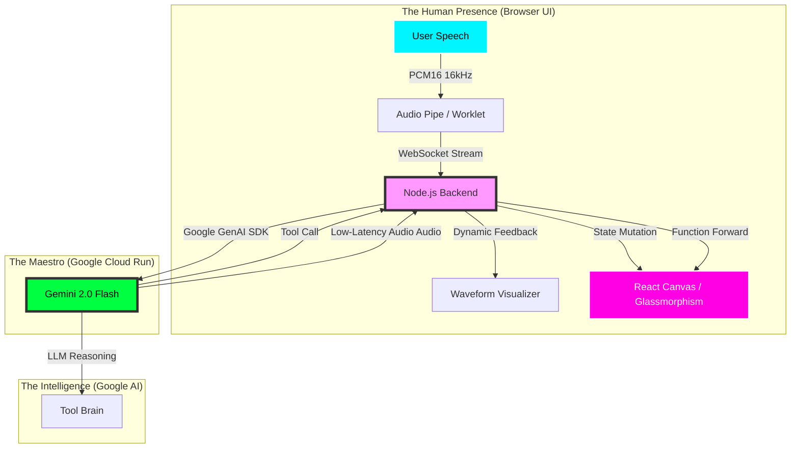
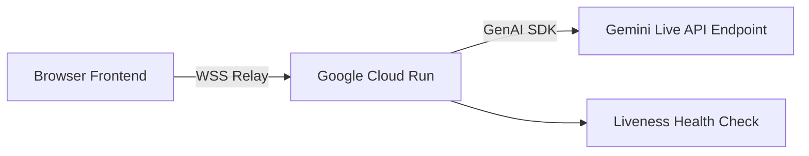

# Dawayir Architecture: The Maestro & The Mental Space

Dawayir is not just an application; it is a **multimodal consciousness bridge** powered by Google Gemini. The architecture follows a high-performance, low-latency relay pattern designed for the Live Agents track of the Gemini Live Agent Challenge.

## The Visual Journey (System Overview)

## Technical Pillars

### 1. High-Fidelity Audio Streaming (The Pulse)
- **Ingress:** The browser captures raw audio through an `AudioWorkletProcessor`, converts it to **PCM16** at **16kHz** (optimized for Gemini), and streams it via high-speed binary WebSockets.
- **Egress:** Gemini returns low-latency audio chunks which are re-assembled and played through the `Web Audio API` using a precision playback queue. This ensures seamless audio delivery even during high-frequency interruptions.

### 2. The Interactive Orchestrator (Node.js Maestro)
The server acts as a **full-duplex bridge** using the `Google GenAI SDK`. It manages the stateful session between the client and Google's servers, ensuring that tool calls are redirected to the frontend in milliseconds.
- **Location:** Deployed on **Google Cloud Run** for sub-second scaling and high availability.
- **Compliance:** 100% Google infrastructure, utilizing SDK-level session management.

### 3. Visual Consciousness (React Canvas State Engine)
- **Dynamic Mental Space:** A bespoke canvas renderer using `requestAnimationFrame` for buttery-smooth animations.
- **Glassmorphism Mapping:** Every "node" (Awareness, Science, Truth) is a state-aware object with individual physics and glowing shaders.
- **AI-Driven Mutations:** When Gemini invokes `update_node` or `highlight_node`, the canvas translates the model's logic into visual "living" changes (size, color, pulsing).
- **Presence Feedback:** A real-time particle nebula and waveform provide the user with confirmation of the "AI's Presence," breaking the fourth wall of traditional chat boxes.

### 4. Scalability & Deployment

- **Deployment:** Zero-downtime CI/CD deployment on Google Cloud.
- **Monitoring:** Real-time telemetry via custom debug pipes sent in each WebSocket event.

## Why This Architecture Wins
By moving logic away from static text and into a **Live State Engine**, Dawayir demonstrates the full power of Gemini's low-latency reasoning. It’s not just an agent that talks; it’s an agent that **acts** on your visual world in real-time.
