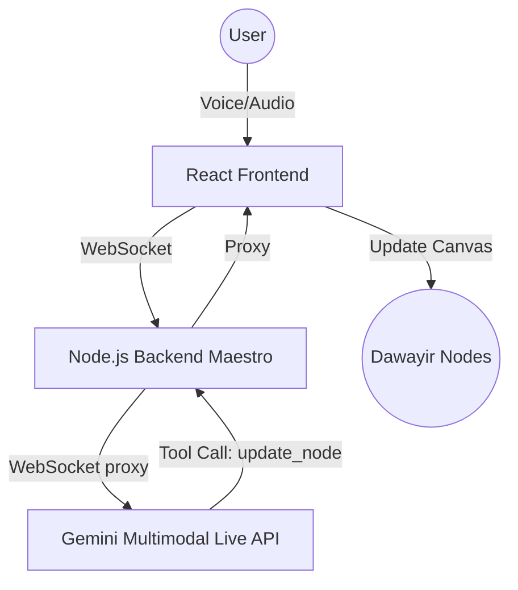

# Dawayir Live Agent 🌌

**"Dawayir" (Circles)** is an interactive AI-driven philosophical exploration engine built for the Google Gemini API Developer Competition. It uses the **Gemini 2.0 Multimodal Live API** to create a "breathing" system where an AI agent can autonomously manipulate a visual canvas of philosophical nodes based on real-time voice conversation.

## 🚀 Key Features

- **Multimodal Live Interaction**: Full-duplex voice and visual communication with Gemini 2.0 Flash.
- **Autonomous Canvas (Magical Interaction)**: The AI agent uses Function Calling to resize, color, and highlight "Dawayir" (nodes) in real-time.
- **Bi-directional WebSocket Proxy**: A robust Node.js backend acting as the maestro between the client and Google's Generative Service.
- **Premium Aesthetics**: A React-based Canvas interface with GLOW effects, pulse animations, and glassmorphism.

## 🧠 Why Dawayir? (First Principles)

In the journey of personal growth, our mental models are often static. **Dawayir** (Arabic for Circles) transforms these models into a dynamic, "breathing" architecture. By leveraging the low-latency capabilities of **Gemini 2.0 Flash**, we've built a system where the AI isn't just an observer—it's an architect of your mental space. When you speak, the system reacts visually, helping you visualize the weight and relationship between different aspects of your life (Awareness, Science, Truth).

## 🏗️ Architecture



## 🛠️ Spin-up Instructions (5 Minutes)

### Prerequisites
- [Node.js v18+](https://nodejs.org/)
- A [Gemini API Key](https://aistudio.google.com/app/apikey)

### 1. Backend Setup
```bash
cd server
npm install
# Create a .env file and add your key:
echo "GEMINI_API_KEY=your_key_here" > .env
node index.js
```

### 2. Frontend Setup
```bash
cd client
npm install
npm run dev
```

### 3. Usage
- Click **"Start Gemini Live Journey"**.
- Try saying: *"Make the circle of Truth (Al-Haqiqa) larger and turn it yellow."*
- Watch the AI autonomously manipulate the canvas!

## ⚙️ Reproducibility (Single-Step Mindset)

We believe in high efficiency. The entire system is built to be reproducible in minutes.
- **Backend**: Containerized with Docker and ready for Google Cloud Run.
- **Frontend**: Clean Vite + React setup with zero complex dependencies.
- **Automation**: Use `cloud-deploy.sh` to go from local code to a live URL in one command.

---
*Created with ❤️ by Antigravity for the Google Gemini Competition.*