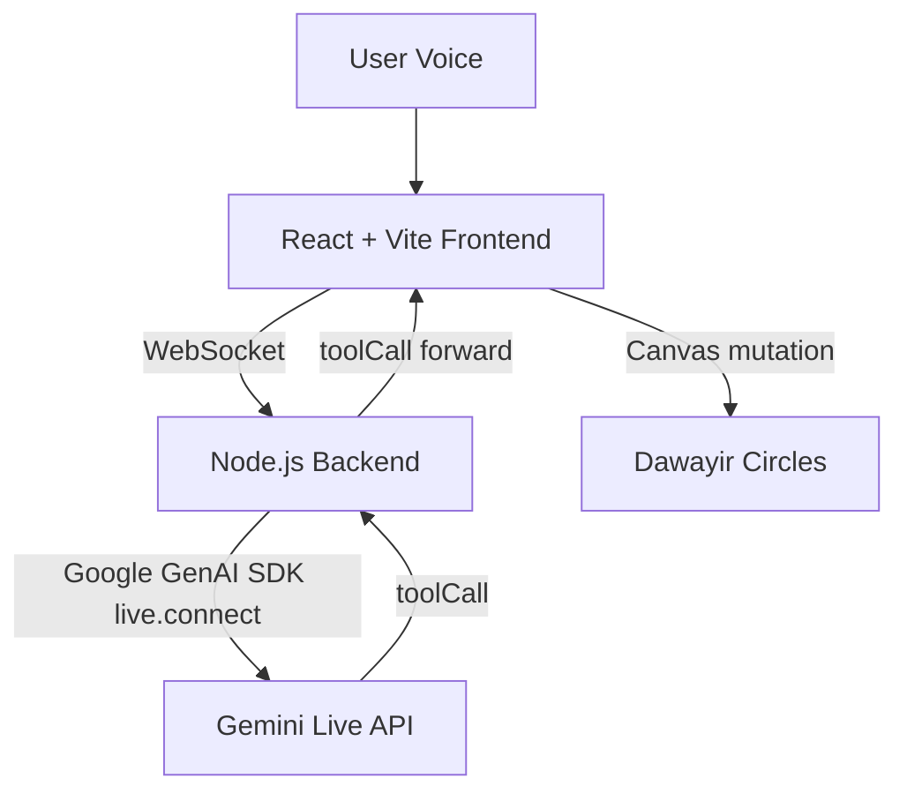

# Dawayir Live Agent

Live, multimodal voice agent for relationship and mental-clarity coaching.
Built for the Google Gemini Live Agent Challenge under the Live Agents track.
Built with `Google GenAI SDK` + `Gemini Live API` + `Google Cloud Run`.

## Competition Positioning
- Official track: Live Agents
- Core value: Real-time spoken conversation + real-time visual world manipulation
- Differentiator: The agent does not only respond with voice, it updates a live canvas through tool calls

## Problem
Most AI experiences are text-first and static. Users describe emotional or relational complexity, but the interface does not change with them in real time.

## Solution
Dawayir introduces a "living canvas" where each circle represents a mental domain. While the user speaks, Gemini Live responds with low-latency audio and can invoke tools to resize, recolor, relabel, or highlight circles.

## Why This Is New
- Full-duplex voice conversation with interruption handling
- Function-calling driven visual state updates
- Google GenAI SDK live-session bridge architecture ready for Cloud Run
- Arabic-aware experience with clear English submission packaging

## Core Features
- Real-time voice conversation over Gemini Live API
- Interruption-aware interaction flow
- Tool calls: `update_node`, `highlight_node`
- Reconnect resilience with bounded retries on frontend
- Debug status line for demo reliability and troubleshooting

## Architecture


More detail: see `ARCHITECTURE.md`.

## Repository Structure
- `client/`: React frontend, microphone/audio pipeline, canvas rendering
- `server/`: Node.js backend with Google GenAI SDK live bridge
- `DEMO_CHECKLIST.md`: pre-flight demo checklist
- `PITCH_SCRIPT.md`: 3:30 competition demo script
- `VIDEO_SHOTLIST.md`: shot-by-shot recording plan
- `DEVPOST_SUBMISSION.md`: copy-ready submission draft
- `CLOUD_PROOF.md`: cloud evidence and verification checklist
- `BONUS_EXECUTION.md`: bonus-point execution assets
- `ACCEPTANCE_SUITE.md`: final acceptance scenarios
- `SUBMISSION_TIMELINE.md`: milestone and go/no-go gates
- `submission-assets/`: folder for screenshots, diagrams, and final demo media

## Prerequisites
- Node.js 18+ (22 recommended)
- Google Gemini API key
- Google Cloud project (for Cloud Run deployment)

## Local Run (5 minutes)
### 1) Backend
```bash
cd server
cp .env.example .env
# edit .env and set GEMINI_API_KEY
npm install
npm start
```
Expected:
- Server listens on `http://localhost:8080`
- Health endpoint: `http://localhost:8080/health` returns `OK`

### 2) Frontend
```bash
cd client
cp .env.example .env.local
# optional: set VITE_BACKEND_WS_URL for cloud backend
npm install
npm run dev
```
Expected:
- Frontend runs on local Vite URL
- Click `Start Gemini Live Journey`
- Status reaches `Connected to Gemini Live`

## Cloud Run Deployment
From `server/`:
```bash
GEMINI_API_KEY=your_key_here ./cloud-deploy.sh
```
Optional overrides:
```bash
PROJECT_ID=your-project-id SERVICE_NAME=dawayir-live-agent REGION=europe-west1 GEMINI_API_KEY=your_key_here ./cloud-deploy.sh
```

Script output includes:
- `SERVICE_URL`
- `HEALTH_CHECK`

## Cloud URL Used For Demo
`wss://dawayir-live-agent-880073923613.europe-west1.run.app`

## Environment Variables
### Frontend (`client/.env.local`)
- `VITE_BACKEND_WS_URL` optional; if absent falls back to `ws://localhost:8080` on localhost

### Backend (`server/.env`)
- `GEMINI_API_KEY` required
- `GEMINI_LIVE_MODEL` optional, default `models/gemini-2.5-flash-native-audio-latest`
- `GEMINI_API_VERSION` optional, default `v1alpha`
- `LOG_LEVEL` optional: `info` or `debug`
- `PORT` optional, default `8080`

## Demo Quick Scenario
1. Start session
2. Say: "Make the Truth circle larger and yellow"
3. Confirm voice response + visual mutation
4. Interrupt mid-response and redirect topic
5. Confirm immediate adaptation and continued conversation

## Acceptance Smoke Tests
Use `ACCEPTANCE_SUITE.md` for the full set.
Minimum pass before recording:
- Cloud WS connect works
- Local fallback works
- Tool invocation mutates canvas
- Interruption handling works
- Reconnect behavior matches expected retries

## Submission Assets
All judge-facing assets are prepared in this repository:
- `DEVPOST_SUBMISSION.md`
- `ARCHITECTURE.md`
- `PITCH_SCRIPT.md`
- `VIDEO_SHOTLIST.md`
- `CLOUD_PROOF.md`
- `BONUS_EXECUTION.md`
- `DEMO_CHECKLIST.md`

## License
ISC
