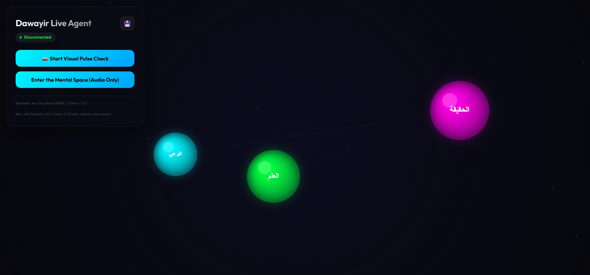
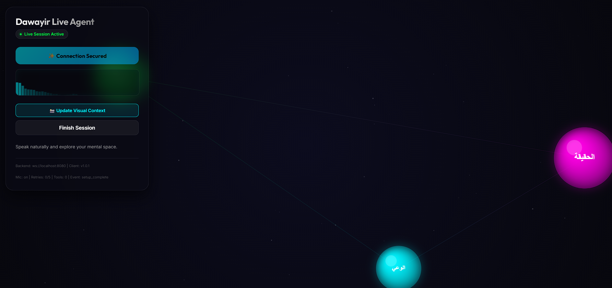
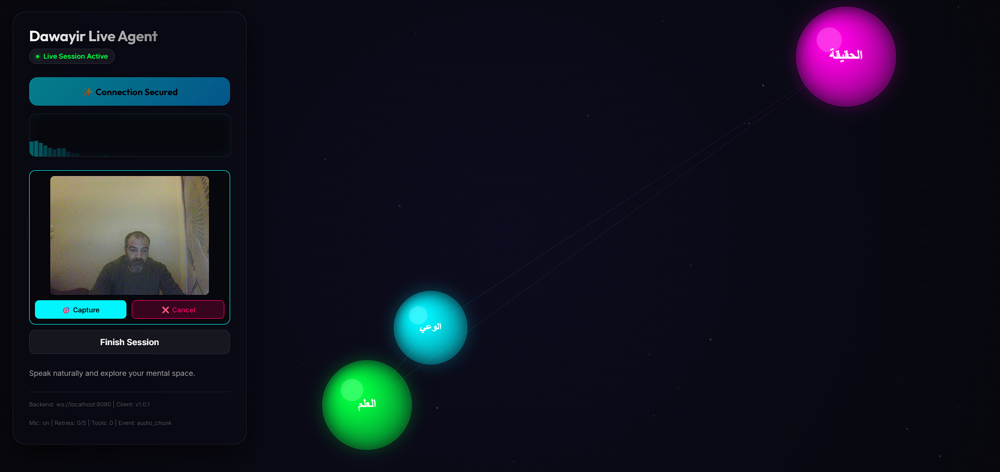

# Dawayir

> The first live cognitive operating system that renders the mind changing in real time.

Built for the Gemini Live Agent Challenge.

## Visual Highlights

### Cinematic Entry



### Live Session



### Vision and Multimodal Update



### Tool Calling on the Canvas


## What It Is

Dawayir is a real-time multimodal AI experience for cognitive and emotional reflection.

Instead of replying with text alone, Dawayir:

- listens through live voice
- sees through optional camera input
- changes a live visual cognitive canvas
- explains why the state changed
- saves, replays, compares, and exports the session

The product is designed around three living circles:

- `Awareness`: present emotion and internal state
- `Knowledge`: structure, reasoning, and interpretation
- `Truth`: clarity, alignment, and decision

## Why It Matters

Most AI mental wellness products are still chat interfaces.

Dawayir is built on a different premise:

> the interface itself should become part of the intervention

The user does not just talk to the system. The user sees their inner state reorganized as the conversation unfolds.

## Core Differentiators

### 1. Live Cognitive Canvas

The agent changes the circles during the conversation, not after it.

### 2. Why Now

Every meaningful visual change can be explained in-session so the user understands why the system shifted focus.

### 3. Interruption First

If the user cuts in, the agent stops quickly and yields control back to the human.

### 4. Replayable Sessions

Sessions are not ephemeral. They become structured artifacts that can be replayed step by step.

### 5. Cross-Session Diff

The product compares one session to another to show cognitive progress over time.

### 6. Judge-Ready Presentation Layer

The app now includes:

- `Judge Mode`
- `One-Click Demo Route`
- `Auto Highlight Reel`
- `Signature Moment`
- `Replay Export`

This makes the product demoable under time pressure without losing the core experience.

## Feature Set

### Live Session

- real-time Gemini Live voice session
- live transcript with Arabic RTL support
- live circle mutation through tool calling
- Egyptian Arabic and English support
- visual diagnostic signals for audio interruption cause
- optional camera snapshot analysis

### Cognitive System Layer

- deterministic server-side cognitive kernel
- guarded tool execution before UI mutation
- live cognitive metrics:
  - clarity
  - equilibrium
  - overload

### Memory Bank

- save mental map
- generate session report
- replay timeline
- replay export to video
- cross-session diff
- signature poster export
- before/after poster export
- voice quote playback
- auto highlight reel

### Presentation Layer

- cinematic entry screen
- one-click live demo from the home screen
- hybrid demo with real user + scripted user agent
- fullscreen judge view
- guided judge route across the strongest proof points

## Competition Positioning

Dawayir should be understood as:

- not a chatbot
- not only a wellness assistant
- not only a voice demo

It is a `Cognitive OS`:

- it senses
- it interprets
- it intervenes visually
- it explains
- it persists state
- it replays progress

## Architecture

### Frontend

- React + Vite
- real-time canvas interaction
- audio playback and microphone capture
- session presentation and replay tools

### Backend

- Node.js
- WebSocket orchestration
- Gemini Live integration
- tool handling and policy enforcement
- session persistence and report generation

### Storage and Infra

- Google Cloud Run
- Google Cloud Storage
- Terraform
- Cloud Build

## Local Development

### Prerequisites

- Node.js 20+
- Gemini API key
- Google Cloud project
- Google Cloud Storage bucket

### Environment

Create `server/.env`:

```dotenv
GEMINI_API_KEY=your_gemini_api_key
GOOGLE_PROJECT_ID=your_project_id
GOOGLE_CLOUD_STORAGE_BUCKET=your_bucket_name
GEMINI_LIVE_MODEL=gemini-2.0-flash-exp
PORT=8080
```

### Run Backend

```bash
cd server
npm install
npm start
```

### Run Frontend

```bash
cd client
npm install
npm run dev
```

Then open:

`http://localhost:5173`

## Demo Flow For Judges

The shortest strong demo route is:

1. click `Run Live Demo`
2. show live voice + circle mutation
3. interrupt the agent once
4. open Memory Bank
5. show Replay
6. show Highlight Reel
7. show Signature Moment
8. show Cross-Session Diff
9. enable Judge Mode or Fullscreen

## Project Structure

```text
dawayir-live-agent/
|- client/
|  |- src/
|  |  |- App.jsx
|  |  |- App.css
|  |  |- components/
|  |  |- dashboard-styles.css
|- server/
|  |- index.js
|  |- knowledge_base.json
|- main.tf
|- ARCHITECTURE.md
|- README.md
```

## Verification

Client build:

```bash
npm run --prefix client build
```

Server tests:

```bash
npm run test:server
```

## Release

Current release target: `v1.0.0`

## License

ISC
