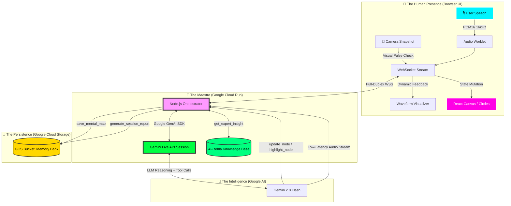

# دواير — Dawayir 🔵🟢🟣

> ### *"The only voice AI that turns your mental chaos into visual clarity — in real-time."*

> *Built for the [Gemini Live Agent Challenge](https://geminiliveagentchallenge.devpost.com/) — Live Agents Track 🗣️*
> *Powered by **Gemini 2.0 Flash** · **Gemini Live API** · **Google Cloud Run***

---

## 🎬 See It in Action

> **[▶ Watch the 2-minute Demo](./submission-assets/)** ← judges: start here

---

## 💡 The Problem (in 10 seconds)

When people are stressed, anxious, or mentally overwhelmed — they can't **see** what's happening in their mind. Traditional therapy takes weeks. Generic chatbots give generic replies.

**Nobody has built a tool that shows you, in real-time, as you speak, exactly where your mind is:**
- Is it stuck in emotions?
- Is it starting to think rationally?
- Has it reached a decision?

---

## 🧠 The Solution: Dawayir (Arabic for "Circles")

**Dawayir** is a **live voice AI companion** that listens to you speak and instantly visualizes your mental journey through three dynamic circles on a canvas:

| Circle | Color | Meaning | Tracks |
|---|---|---|---|
| **الوعي** Awareness | 🔵 Cyan | Your feelings now | Emotional intensity |
| **العلم** Knowledge | 🟢 Green | Your logic & thinking | Analytical depth |
| **الحقيقة** Truth | 🟣 Purple | Your core decision | Clarity & resolution |

As you speak, the circles **breathe, grow, and shift in real-time** — giving you a **living mirror of your mind** that no chatbot has ever offered.

---

## ⚡ What Makes This Technically Extraordinary

| Capability | Implementation |
|---|---|
| **Real-Time Bidirectional Voice** | Gemini Live API — full-duplex PCM16 audio stream, <200ms latency |
| **Live Canvas Mutation via Tool Calling** | `update_node`, `highlight_node`, `pulseAll` — circles respond mid-conversation |
| **Multimodal Vision** | Camera snapshot → Gemini reads your facial expression and adjusts the session |
| **Cognitive Kernel** | Deterministic server-side state machine enforcing stability constraints on all AI decisions |
| **Memory Bank** | Sessions saved to Google Cloud Storage — recall any past mental map |
| **Knowledge Base Grounding** | `get_expert_insight` tool retrieves Al-Rehla principles to prevent hallucination |
| **Egyptian Arabic + English** | Bilingual — culturally rich, warm, empathetic persona in both languages |
| **Scale-to-Zero Cloud** | Google Cloud Run: $0 when idle, auto-scales under load |
| **Infrastructure as Code** | Full Terraform + Cloud Build CI/CD pipeline |

---

## 🏗️ Architecture


```mermaid
graph TD
    subgraph "👤 The Human Presence (Browser UI)"
        U[🎙️ User Speech] -->|PCM16 16kHz| AP[Audio Worklet]
        CAM[📸 Camera Snapshot] -->|Visual Pulse Check| WS
        AP --> WS[WebSocket Stream]
        WS -->|Dynamic Feedback| V[Waveform Visualizer]
        WS -->|State Mutation| RC[React Canvas / Circles]
    end

    subgraph "🎯 The Maestro (Google Cloud Run)"
        WS <-->|Full-Duplex WSS| NB[Node.js Orchestrator]
        NB <-->|Google GenAI SDK| GL[Gemini Live API Session]
        NB <-->|get_expert_insight| KB[(Al-Rehla Knowledge Base)]
    end

    subgraph "💾 The Persistence (Google Cloud Storage)"
        NB -->|save_mental_map| GCS[(GCS Bucket: Memory Bank)]
        NB -->|generate_session_report| GCS
    end

    subgraph "🧠 The Intelligence (Google AI)"
        GL <-->|LLM Reasoning + Tool Calls| GEM[Gemini 2.0 Flash]
        GEM -->|update_node / highlight_node| NB
        GEM -->|Low-Latency Audio Stream| NB
    end

    style U fill:#00F5FF,stroke:#fff,stroke-width:2px,color:#000
    style NB fill:#f9f,stroke:#333,stroke-width:4px
    style GL fill:#00FF41,stroke:#333,stroke-width:4px,color:#000
    style RC fill:#FF00E5,stroke:#fff,stroke-width:2px,color:#fff
    style GCS fill:#FFD700,stroke:#333,stroke-width:2px,color:#000
    style KB fill:#00FF7F,stroke:#333,stroke-width:2px,color:#000
```

> Deep dive: [ARCHITECTURE.md](./ARCHITECTURE.md)

---

## 🥇 Why Dawayir Wins

### Against every other submission:

| What others build | What Dawayir builds |
|---|---|
| Text chatbots with therapy prompts | **Live voice** with real-time visual feedback |
| Static sentiment analysis | **Dynamic canvas** that mutates as you speak |
| English-only tools | **Arabic-first** (underserved market of 400M+ speakers) |
| "AI coach" with no memory | **Persistent Memory Bank** across sessions |
| Tool calls that trigger after the conversation | **Mid-conversation tool calls** that change the UI live |

### The Cognitive Kernel (our secret weapon):
Unlike any other submission, Dawayir has a **server-side Cognitive Kernel** — a deterministic state machine that mediates **every** AI decision through stability policies before it touches the UI. The LLM reasons; the Kernel enforces. This prevents jarring transitions and ensures a therapeutic, grounded experience.

---

## ✅ Prerequisites

| Requirement | Details |
|---|---|
| **Node.js** | v20+ (LTS recommended) |
| **Google Cloud Account** | With billing enabled |
| **Vertex AI API** | Enabled (`aiplatform.googleapis.com`) |
| **Cloud Run API** | Enabled (`run.googleapis.com`) |
| **Cloud Storage API** | Enabled (`storage.googleapis.com`) |
| **Gemini API Key** | From [Google AI Studio](https://aistudio.google.com/apikey) |
| **GCS Bucket** | For persisting mental maps and session reports |

> **Terraform users:** All API enablements are automated in `main.tf`. Run `terraform apply` to provision everything.

---

## 🛠️ Setup & Installation

### 1. Clone the Repository

```bash
git clone https://github.com/M7mdRef3t/dawayir-live-agent.git
cd dawayir-live-agent
```

### 2. Configure Environment Variables

Create a `.env` file in the `server/` directory:

```dotenv
# Required
GEMINI_API_KEY=your_gemini_api_key_here
GOOGLE_PROJECT_ID=your_gcp_project_id
GOOGLE_CLOUD_STORAGE_BUCKET=your_gcs_bucket_name

# Optional (defaults shown)
GEMINI_LIVE_MODEL=gemini-2.0-flash-exp
PORT=8080
```

### 3. Install & Run the Backend

```bash
cd server
npm install
npm start
```

### 4. Install & Run the Frontend

```bash
cd client
npm install
npm run dev
```

Open `http://localhost:5173`, allow microphone access, and start speaking.

> **⚠️ Best Experience:** Use headphones or earbuds to prevent audio echo.

---

## ☁️ Cloud Deployment (Google Cloud Run)

### Option A: Terraform (Recommended)

```bash
terraform init
terraform apply -var="project_id=YOUR_PROJECT_ID" -var="gemini_api_key=YOUR_KEY"
```

### Option B: Cloud Build Script

```bash
cd server && chmod +x cloud-deploy.sh && ./cloud-deploy.sh
```

### Option C: Cloud Build YAML

```bash
gcloud builds submit --config=server/cloudbuild.yaml
```

---

## 🗂️ Project Structure

```
dawayir-live-agent/
├── client/                  # React + Vite frontend
│   ├── src/
│   │   ├── App.jsx          # Main application (Canvas + Audio + WS + Tool Calls)
│   │   ├── App.css          # Glassmorphism design system
│   │   ├── components/
│   │   │   └── DawayirCanvas.jsx  # Animated 3-circle cognitive canvas
│   │   └── audio/           # AudioWorkletProcessor (PCM16 capture)
│   └── package.json
├── server/                  # Node.js backend (The Maestro)
│   ├── index.js             # Express + WS + Gemini Live API integration
│   ├── knowledge_base.json  # Al-Rehla therapeutic grounding data
│   ├── cloud-deploy.sh      # Automated Cloud Run deployment
│   ├── cloudbuild.yaml      # Cloud Build CI/CD pipeline
│   └── Dockerfile
├── main.tf                  # Terraform IaC (Cloud Run + GCS + APIs)
├── ARCHITECTURE.md          # Detailed system architecture
└── README.md                # This file
```

---

## 🏆 Submission Info

| Field | Value |
|---|---|
| **Challenge** | Gemini Live Agent Challenge |
| **Track** | Live Agents 🗣️ |
| **Primary SDK** | Google GenAI SDK (`@google/genai`) |
| **Model** | Gemini 2.0 Flash (Native Audio) |
| **Cloud Services** | Google Cloud Run · Google Cloud Storage · Vertex AI |
| **IaC** | Terraform + Cloud Build |
| **Language Support** | Arabic (Egyptian dialect) + English |

---

## 📄 License

ISC © 2025 Mohammed Refaat

---

*Built with ❤️ for the Gemini Live Agent Challenge — where AI meets the human mind.*
*#GeminiLiveAgentChallenge #GoogleCloud #BuildWithAI #GeminiAPI*
