# Dawayir (دوائر) — Real-Time Multimodal Mental Clarity Agent 🧠✨

> **"From Static Chatbots to Living, Breathing AI Companions"**
>
> *Built for the [Gemini Live Agent Challenge](https://geminiliveagentchallenge.devpost.com/) — Live Agents Track 🗣️*

---

## 🌟 Project Overview

**Dawayir** (Arabic for "Circles") is a **real-time multimodal consciousness facilitator** that uses the **Gemini Live API** to analyze and visualize a user's mental state through voice, vision, and an interactive canvas — all in real-time.

Unlike traditional chatbots constrained to text boxes, Dawayir creates a **living mental space** where three interactive circles — **الوعي (Awareness)**, **العلم (Knowledge)**, and **الحقيقة (Truth)** — dynamically change size, color, and behavior based on what the user shares verbally and visually. The AI doesn't just talk; it **acts, remembers, and visualizes** your inner world.

Dawayir is **grounded** in the proprietary **Al-Rehla (الرحلة)** psychological framework, ensuring every insight is scientifically backed by core therapeutic principles — not hallucinated.

### Architecture Diagram

```mermaid
graph TD
    subgraph "👤 The Human Presence (Browser UI)"
        U[🎙️ User Speech] -->|PCM16 16kHz| AP[Audio Pipe / Worklet]
        CAM[📸 Camera Snapshot] -->|Visual Pulse Check| WS
        AP --> WS[WebSocket Stream]
        WS -->|Dynamic Feedback| V[Waveform Visualizer]
        WS -->|State Mutation| RC[React Canvas / Glassmorphism]
    end

    subgraph "🎯 The Maestro (Google Cloud Run)"
        WS <-->|Full-Duplex WSS| NB[Node.js Orchestrator]
        NB <-->|Google GenAI SDK| GL[Gemini Live API Session]
        NB <-->|get_expert_insight| KB[(Al-Rehla Knowledge Base)]
    end

    subgraph "💾 The Persistence (Google Cloud Storage)"
        NB -->|save_mental_map| GCS[(GCS Bucket: Memory Bank)]
        NB -->|generate_session_report| GCS
    end

    subgraph "🧠 The Intelligence (Google AI)"
        GL <-->|LLM Reasoning + Tool Calls| GEM[Gemini 2.5 Flash]
        GEM -->|update_node / highlight_node| NB
        GEM -->|Low-Latency Audio Stream| NB
    end

    style U fill:#00F5FF,stroke:#fff,stroke-width:2px,color:#000
    style NB fill:#f9f,stroke:#333,stroke-width:4px
    style GL fill:#00FF41,stroke:#333,stroke-width:4px,color:#000
    style RC fill:#FF00E5,stroke:#fff,stroke-width:2px,color:#fff
    style GCS fill:#FFD700,stroke:#333,stroke-width:2px,color:#000
    style KB fill:#00FF7F,stroke:#333,stroke-width:2px,color:#000
```



> For a deep-dive into the architecture, see [ARCHITECTURE.md](./ARCHITECTURE.md).

---

## ✅ Prerequisites

Before running Dawayir locally, ensure you have:

| Requirement | Details |
|---|---|
| **Node.js** | v20+ (LTS recommended) |
| **Google Cloud Account** | With billing enabled |
| **Vertex AI API** | Enabled (`aiplatform.googleapis.com`) |
| **Cloud Run API** | Enabled (`run.googleapis.com`) |
| **Cloud Storage API** | Enabled (`storage.googleapis.com`) |
| **Gemini API Key** | Obtainable from [Google AI Studio](https://aistudio.google.com/apikey) |
| **GCS Bucket** | For persisting mental maps and session reports |

> **Terraform users:** All API enablements are automated in `main.tf`. Run `terraform apply` to provision everything.

---

## 🛠️ Setup & Installation

### 1. Clone the Repository

```bash
git clone https://github.com/M7mdRef3t/dawayir-live-agent.git
cd dawayir-live-agent
```

### 2. Configure Environment Variables

Create a `.env` file in the `server/` directory:

```bash
cd server
cp .env.example .env   # Or create manually:
```

```dotenv
# Required
GEMINI_API_KEY=your_gemini_api_key_here
GOOGLE_PROJECT_ID=your_gcp_project_id
GOOGLE_CLOUD_STORAGE_BUCKET=your_gcs_bucket_name

# Optional (defaults shown)
GEMINI_LIVE_MODEL=gemini-2.5-flash-native-audio-preview-12-2025
GEMINI_API_VERSION=v1alpha
PORT=8080
LOG_LEVEL=info
```

### 3. Install & Run the Backend (The Maestro)

```bash
cd server
npm install
npm start
```

The server starts on `http://localhost:8080` with WebSocket support.

### 4. Install & Run the Frontend (The Pulse)

```bash
cd client
npm install
npm run dev
```

The frontend starts on `http://localhost:5173` and connects to the backend WebSocket.

### 5. Open in Browser

Navigate to `http://localhost:5173`, allow microphone access, and start speaking.

> **⚠️ Best Experience:** Use headphones or earbuds for optimal interruption handling and to prevent echo.

---

## ☁️ Cloud Deployment (Google Cloud Run)

### Option A: Automated via Terraform (Recommended)

```bash
# From project root
terraform init
terraform apply -var="project_id=YOUR_PROJECT_ID" -var="gemini_api_key=YOUR_KEY"
```

This provisions Cloud Run, GCS bucket, IAM policies, and enables all required APIs (including Vertex AI).

### Option B: Manual via Cloud Build

```bash
cd server
chmod +x cloud-deploy.sh
./cloud-deploy.sh
```

### Option C: Cloud Build YAML

```bash
gcloud builds submit --config=server/cloudbuild.yaml
```

> See [cloud-deploy.sh](./server/cloud-deploy.sh), [cloudbuild.yaml](./server/cloudbuild.yaml), and [main.tf](./main.tf) for full automation proof.

---

## 🚀 Key Features & Technical Strengths

| Feature | Implementation |
|---|---|
| **Ultra-Low Latency (<200ms)** | Full-duplex WebSocket streaming with PCM16 audio — zero REST overhead |
| **Live Tool Calling** | `update_node`, `highlight_node`, `save_mental_map`, `generate_session_report`, `get_expert_insight` |
| **Multimodal Vision** | Camera snapshot analysis via Visual Pulse Check for facial/emotional context |
| **Knowledge Base Grounding** | Server-side `get_expert_insight` tool retrieves Al-Rehla principles to prevent hallucination |
| **Cloud Memory Persistence** | Mental maps & session reports saved to Google Cloud Storage |
| **Token Optimization** | Context compression via `save_mental_map` + visual downsampling to control API costs |
| **Scale-to-Zero** | Cloud Run ensures $0 compute cost when idle |
| **Infrastructure as Code** | Full Terraform + Cloud Build pipeline for automated deployment |
| **Interruption Handling** | Barge-in support for natural conversation flow |
| **Egyptian Arabic Persona** | Warm, empathetic, culturally-aware mental clarity coaching |

---

## 🗂️ Project Structure

```
dawayir-live-agent/
├── client/                  # React + Vite frontend
│   ├── src/
│   │   ├── App.jsx          # Main application (Canvas + Audio + WS)
│   │   ├── App.css          # Glassmorphism design system
│   │   └── audio/           # AudioWorkletProcessor (PCM16 capture)
│   └── package.json
├── server/                  # Node.js backend (The Maestro)
│   ├── index.js             # Express + WS + Gemini Live API integration
│   ├── knowledge_base.json  # Al-Rehla grounding data
│   ├── cloud-deploy.sh      # Automated Cloud Run deployment
│   ├── cloudbuild.yaml      # Cloud Build CI/CD pipeline
│   ├── Dockerfile           # Container configuration
│   └── package.json
├── main.tf                  # Terraform IaC (Cloud Run + GCS + APIs)
├── ARCHITECTURE.md          # Detailed system architecture
├── TECHNICAL_BLOG_POST.md   # Published content (bonus)
└── README.md                # This file
```

---

## 🏆 Submission Info

| Field | Value |
|---|---|
| **Challenge** | Gemini Live Agent Challenge |
| **Track** | Live Agents 🗣️ |
| **Primary SDK** | Google GenAI SDK (`@google/genai` v1.42.0) |
| **Model** | Gemini 2.5 Flash (Native Audio) |
| **Cloud Services** | Google Cloud Run, Google Cloud Storage, Vertex AI API |
| **IaC** | Terraform + Cloud Build |

---

## 📄 License

ISC © 2025 Mohammed Refaat

---

*Created with ❤️ for the Gemini Live Agent Challenge*
*#GeminiLiveAgentChallenge #GoogleCloud #BuildWithAI #GeminiAPI*
