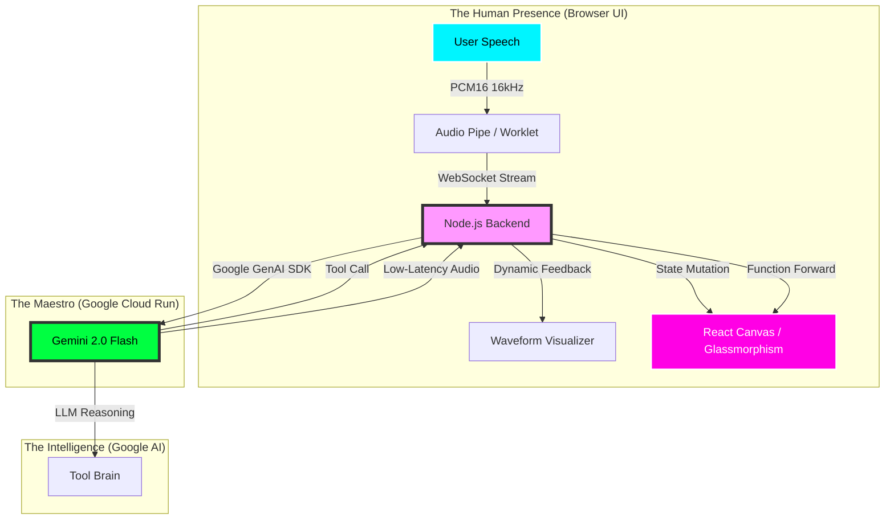
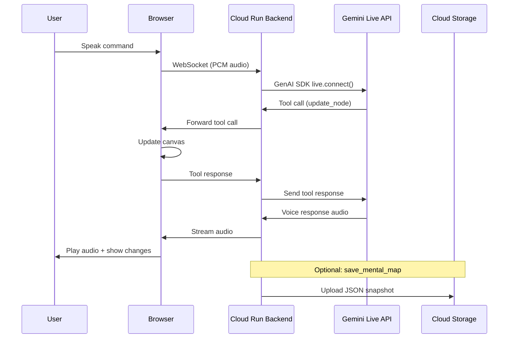
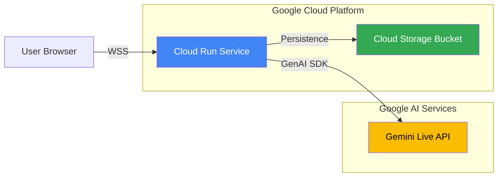

# Screenshot & Visual Assets Guide
# Dawayir Live Agent - Google Gemini Live Agent Challenge

**Purpose:** Capture high-quality evidence for Devpost submission and judging

---

## 📁 Folder Structure

```
submission-assets/
├── architecture/
│   ├── system-overview.png         (Main architecture diagram)
│   ├── data-flow.png              (How data flows through system)
│   └── deployment-diagram.png      (Cloud Run deployment view)
├── cloud-proof/
│   ├── cloud-run-service.png       (Service overview page)
│   ├── cloud-run-revision.png      (Latest revision details)
│   ├── health-check.png            (Health endpoint response)
│   ├── websocket-connect.png       (WebSocket connection proof)
│   └── gcs-bucket.png              (Cloud Storage bucket with saved maps)
├── ui-demo/
│   ├── homepage-idle.png           (Initial state with circles)
│   ├── connected-status.png        (Connected to Gemini Live status)
│   ├── tool-call-before.png        (Before circle change)
│   ├── tool-call-after.png         (After circle change)
│   ├── highlight-effect.png        (Circle highlighting animation)
│   ├── debug-line.png              (Debug status visible)
│   └── interruption-demo.gif       (GIF showing interruption handling)
├── social-media/
│   ├── demo-clip.gif               (15-30 second demo loop)
│   ├── feature-showcase.png        (Key features highlight)
│   └── architecture-simple.png     (Simplified diagram for social)
└── video/
    └── final-demo.mp4              (< 4 minutes final video)
```

---

## 1️⃣ Architecture Diagrams

### A) System Overview (from ARCHITECTURE.md)

**Method 1: Mermaid Live Editor (Recommended)**
1. Visit: https://mermaid.live/
2. Copy the main diagram from `ARCHITECTURE.md` (lines 7-31)
3. Paste into editor
4. Customize theme: `Configuration` → `Theme: dark` or `neutral`
5. Export: `Actions` → `PNG` or `SVG`
6. Save as: `submission-assets/architecture/system-overview.png`

**Diagram to Export:**


**Method 2: Using CLI (if mermaid-cli installed)**
```bash
# Install if needed
npm install -g @mermaid-js/mermaid-cli

# Generate from markdown
mmdc -i ARCHITECTURE.md -o submission-assets/architecture/system-overview.png -b transparent -w 1920 -H 1080
```

### B) Simple Data Flow Diagram

**Create this diagram at Mermaid Live:**


Save as: `submission-assets/architecture/data-flow.png`

### C) Deployment Architecture

**Create simple cloud diagram:**


Save as: `submission-assets/architecture/deployment-diagram.png`

**Expected Deliverables:**
- [ ] system-overview.png (1920x1080 recommended)
- [ ] data-flow.png (sequence diagram)
- [ ] deployment-diagram.png (cloud architecture)

---

## 2️⃣ Cloud Deployment Proof

### A) Cloud Run Service Overview

**Steps:**
1. Open Google Cloud Console: https://console.cloud.google.com/
2. Navigate to: `Cloud Run` → `Services`
3. Click on: `dawayir-live-agent`
4. Capture screenshot showing:
   - ✅ Service name
   - ✅ URL: `https://dawayir-live-agent-880073923613.europe-west1.run.app`
   - ✅ Region: `europe-west1`
   - ✅ Last deployment time
   - ✅ Status: Running/Healthy

**Save as:** `submission-assets/cloud-proof/cloud-run-service.png`

**Screenshot Requirements:**
- Full browser window (include URL bar showing console.cloud.google.com)
- Clear service status indicator
- Timestamp visible
- Resolution: 1920x1080 or higher

---

### B) Cloud Run Revision Details

**Steps:**
1. In Cloud Run service page, click `REVISIONS` tab
2. Click on latest revision
3. Capture screenshot showing:
   - ✅ Revision ID
   - ✅ Container image name
   - ✅ Environment variables (blur GEMINI_API_KEY!)
   - ✅ Service account
   - ✅ Concurrency settings

**Save as:** `submission-assets/cloud-proof/cloud-run-revision.png`

**Security Note:** ⚠️ BLUR OR HIDE the GEMINI_API_KEY value!

---

### C) Health Endpoint Response

**Method 1: Browser Screenshot**
1. Open browser
2. Navigate to: `https://dawayir-live-agent-880073923613.europe-west1.run.app/health`
3. Capture screenshot showing:
   - ✅ URL in address bar
   - ✅ Response: `OK`
   - ✅ HTTP 200 status

**Method 2: Terminal/Curl Screenshot**
```bash
curl -i https://dawayir-live-agent-880073923613.europe-west1.run.app/health
```
Capture terminal output showing:
- ✅ `HTTP/1.1 200 OK`
- ✅ `server: Google Frontend`
- ✅ Body: `OK`

**Save as:** `submission-assets/cloud-proof/health-check.png`

---

### D) WebSocket Connection Proof

**Steps:**
1. Open browser Developer Tools (F12)
2. Go to `Network` tab
3. Filter by `WS` (WebSocket)
4. Open the Dawayir frontend and click "Start"
5. Capture screenshot showing:
   - ✅ WebSocket connection to Cloud Run URL
   - ✅ Status: `101 Switching Protocols`
   - ✅ Messages flowing (setup, audio chunks, tool calls)

**Alternative: Code Snippet Output**
```bash
node -e "const WebSocket=require('ws');const ws=new WebSocket('wss://dawayir-live-agent-880073923613.europe-west1.run.app');ws.on('open',()=>console.log('✅ Connected'));ws.on('message',d=>console.log('📩 Message:',String(d).substring(0,100)));setTimeout(()=>ws.close(),3000);"
```

**Save as:** `submission-assets/cloud-proof/websocket-connect.png`

---

### E) Cloud Storage Bucket (Optional but Impressive)

**If GCS bucket is configured:**
1. Navigate to: `Cloud Storage` → `Buckets`
2. Open your bucket
3. Show saved mental map JSON files
4. Capture screenshot showing:
   - ✅ Bucket name
   - ✅ Files with `mental_map_*.json` pattern
   - ✅ Timestamps
   - ✅ File sizes

**Save as:** `submission-assets/cloud-proof/gcs-bucket.png`

**Bonus:** Click on a file and show JSON content preview

---

## 3️⃣ UI & Interaction Screenshots

### A) Homepage - Idle State

**Steps:**
1. Open frontend (local or cloud)
2. Before clicking "Start"
3. Capture showing:
   - ✅ All three circles visible (Awareness, Science, Truth)
   - ✅ Start button prominent
   - ✅ Clean UI with glassmorphism effects
   - ✅ Background nebula/particles

**Save as:** `submission-assets/ui-demo/homepage-idle.png`

**Composition Tips:**
- Center the canvas
- Full viewport (show entire interface)
- High resolution (at least 1920x1080)

---

### B) Connected Status

**Steps:**
1. Click "Start Gemini Live Journey"
2. Grant mic permission
3. Wait for connection
4. Capture showing:
   - ✅ Status badge: "Connected to Gemini Live"
   - ✅ Debug line visible with connection info
   - ✅ Waveform visualizer active
   - ✅ Circles ready for interaction

**Save as:** `submission-assets/ui-demo/connected-status.png`

---

### C) Tool Call Demonstration (Before/After)

**Before Screenshot:**
1. Connected and idle
2. All circles in default state
3. Capture baseline state

**Save as:** `submission-assets/ui-demo/tool-call-before.png`

**Interaction:**
- Say: "Make the Truth circle larger and turn it yellow"

**After Screenshot:**
1. Wait for tool call to execute
2. Capture changed state showing:
   - ✅ Truth circle (Circle 3) noticeably larger
   - ✅ Color changed to yellow/golden
   - ✅ Tool counter incremented in debug line
   - ✅ Smooth transition complete

**Save as:** `submission-assets/ui-demo/tool-call-after.png`

**Bonus:** Create a side-by-side comparison image

---

### D) Highlight Effect

**Steps:**
1. Say: "Focus on Awareness" or "highlight the Awareness circle"
2. Capture during pulsing animation showing:
   - ✅ Circle glowing/pulsing
   - ✅ Visual emphasis clear
   - ✅ Other circles dimmed or normal

**Save as:** `submission-assets/ui-demo/highlight-effect.png`

**Tips:** May need multiple captures to catch the animation peak

---

### E) Debug Status Line

**Steps:**
1. During active session
2. Zoom in on debug line
3. Capture showing:
   - ✅ Setup status
   - ✅ Mic status
   - ✅ Retry count
   - ✅ Tool call count
   - ✅ Last event timestamp

**Save as:** `submission-assets/ui-demo/debug-line.png`

**Purpose:** Shows technical sophistication and monitoring

---

### F) Interruption Demo (GIF)

**Recording Tool:** Use LICEcap, ScreenToGif, or browser extension

**Steps:**
1. Start screen recording (10-15 seconds max)
2. Trigger agent to speak
3. Visibly interrupt mid-sentence
4. Show agent stopping and responding to new input
5. Stop recording

**Requirements:**
- Duration: 10-15 seconds
- Format: GIF
- Resolution: 1280x720 (smaller for sharing)
- Frame rate: 15-20 fps

**Save as:** `submission-assets/ui-demo/interruption-demo.gif`

**Bonus Points:** This is VERY shareable on social media!

---

## 4️⃣ Social Media Assets

### A) Demo Clip (Short GIF)

**Purpose:** Shareable 15-30 second demo for social posts

**Recommended Flow:**
1. Show idle state (2 sec)
2. Click start (1 sec)
3. Connection status (2 sec)
4. Speak command (3 sec)
5. Show circle changing (3 sec)
6. Final state with effect (4 sec)

**Format:**
- GIF (for Twitter/LinkedIn inline play)
- Duration: 15-30 seconds
- Resolution: 1280x720 (mobile-friendly)
- Loop: Yes

**Save as:** `submission-assets/social-media/demo-clip.gif`

**Alternative:** MP4 for better quality, same duration

---

### B) Feature Showcase Image

**Create a composite image showing:**
- Voice interaction icon/screenshot
- Tool calling visualization
- Cloud deployment badge
- Multi-language support (Arabic + English)

**Tools:** Canva, Figma, or Photoshop

**Dimensions:** 1200x630 (optimal for social media)

**Save as:** `submission-assets/social-media/feature-showcase.png`

---

### C) Simplified Architecture (Social-Friendly)

**Create a very simple, visual flow:**
```
🎤 User Voice → ☁️ Cloud Run → 🤖 Gemini Live → 🔧 Tool Calls → 🎨 Visual Canvas
```

**Make it:**
- Colorful and eye-catching
- Easy to understand at a glance
- Use emojis or icons
- Not too technical

**Save as:** `submission-assets/social-media/architecture-simple.png`

---

## 5️⃣ Video Assets

### Recording Tips

**Software Options:**
- **Windows:** OBS Studio, ShareX, Windows Game Bar
- **Mac:** QuickTime, ScreenFlow, Camtasia
- **Linux:** SimpleScreenRecorder, OBS Studio
- **Online:** Loom, Screencast-O-Matic

**Settings:**
- Resolution: 1920x1080 (1080p)
- Frame Rate: 30fps or 60fps
- Bitrate: 5-10 Mbps
- Audio: 44.1kHz, stereo, good microphone

**Environment:**
- Quiet room (no background noise)
- Close unnecessary apps
- Disable notifications
- Clean browser profile
- Stable internet connection
- Test mic levels first

### Script Following

**Use PITCH_SCRIPT.md exactly:**
- Practice 3-5 times before recording
- Keep energy up (voice modulation)
- Pace yourself (not too fast)
- Show confidence
- Smile (it comes through in voice!)

### Post-Production Checklist

**Editing:**
- [ ] Trim dead air at start/end
- [ ] Remove long pauses or mistakes
- [ ] Add title card (optional): "Dawayir Live Agent - Google Gemini Challenge"
- [ ] Add captions/subtitles (highly recommended for accessibility)
- [ ] Ensure total duration < 4:00 minutes

**Quality Check:**
- [ ] Audio clear and audible
- [ ] Video smooth (no stuttering)
- [ ] All features demonstrated work correctly
- [ ] No sensitive information visible
- [ ] Export in MP4 (H.264 codec)

**Upload:**
- Primary: YouTube (unlisted or public)
- Backup: Vimeo or Google Drive
- Get shareable link
- Test link in incognito mode

**Save as:** `submission-assets/video/final-demo.mp4` (local backup)

---

## 6️⃣ Screenshot Best Practices

### Technical Requirements
- **Format:** PNG (for screenshots), GIF (for animations), MP4 (for video)
- **Resolution:** Minimum 1280x720, recommended 1920x1080
- **Color:** RGB, not CMYK
- **File Size:** < 5MB per image (compress if needed)

### Composition
- Clean background (close unnecessary windows/tabs)
- Full browser window when showing web interfaces
- Zoom in for detail shots (debug line, status indicators)
- Good contrast and readability
- No personal information visible

### Naming Convention
```
[category]-[description]-[version].png

Examples:
cloud-proof-service-overview-v1.png
ui-demo-connected-status-final.png
architecture-system-overview-export.png
```

### Compression Tools
- TinyPNG: https://tinypng.com/
- Squoosh: https://squoosh.app/
- ImageOptim (Mac)

---

## 7️⃣ Checklist Before Submission

### Architecture Diagrams
- [ ] system-overview.png created (1920x1080+)
- [ ] data-flow.png created (sequence diagram)
- [ ] deployment-diagram.png created
- [ ] All diagrams clear and professional
- [ ] Diagrams use consistent styling

### Cloud Proof
- [ ] cloud-run-service.png (service overview)
- [ ] cloud-run-revision.png (latest revision, API key hidden!)
- [ ] health-check.png (shows HTTP 200 + OK)
- [ ] websocket-connect.png (shows WS connection)
- [ ] gcs-bucket.png (if GCS configured, optional)

### UI Demo
- [ ] homepage-idle.png (clean initial state)
- [ ] connected-status.png (shows connection)
- [ ] tool-call-before.png (baseline)
- [ ] tool-call-after.png (shows change)
- [ ] highlight-effect.png (pulsing animation)
- [ ] debug-line.png (technical monitoring)
- [ ] interruption-demo.gif (15 sec demo)

### Social Media
- [ ] demo-clip.gif (15-30 sec shareable)
- [ ] feature-showcase.png (composite)
- [ ] architecture-simple.png (social-friendly)

### Video
- [ ] final-demo.mp4 recorded
- [ ] Duration under 4 minutes
- [ ] Uploaded to YouTube
- [ ] Link tested and working

### Organization
- [ ] All files in submission-assets/ folders
- [ ] Consistent naming convention
- [ ] No duplicates or old versions
- [ ] README.md in submission-assets/ updated
- [ ] All files backed up

---

## 8️⃣ Quick Capture Schedule

**Day 1-2: Architecture & Cloud Proof**
- Export Mermaid diagrams
- Capture Cloud Run screenshots
- Test health endpoint

**Day 3-4: UI Screenshots**
- Run local demo
- Capture all interaction states
- Create before/after comparisons
- Record GIFs

**Day 5: Social Media Assets**
- Create shareable GIF
- Design feature showcase
- Prepare simplified diagrams

**Day 6-8: Video Production**
- Record multiple takes
- Select best take
- Edit and add captions
- Upload and verify

**Day 9: Final Review**
- Check all assets
- Verify quality
- Compress files
- Organize folders

---

## 🎯 Pro Tips

1. **Take Multiple Shots:** Capture 3-5 versions of each screenshot
2. **Use High-DPI Display:** Retina/4K screens give better quality
3. **Clean UI:** Hide bookmarks bar, close extra tabs
4. **Consistent Lighting:** If recording video, use good lighting
5. **Test on Mobile:** Check how images look on small screens
6. **Accessibility:** Ensure text is readable, good contrast
7. **Backup Everything:** Store copies in multiple locations

---

## 📞 Need Help?

**Tools:**
- Mermaid Live: https://mermaid.live/
- LICEcap (GIF): https://www.cockos.com/licecap/
- OBS Studio: https://obsproject.com/
- ShareX (Windows): https://getsharex.com/

**Resources:**
- Video editing: DaVinci Resolve (free)
- Captions: YouTube auto-captions + manual review
- Compression: HandBrake for video

---

**Ready to capture! Follow this guide step-by-step and you'll have professional submission assets! 📸🎬**
